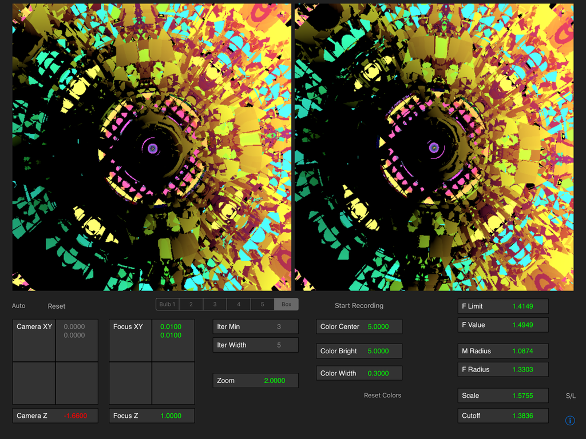
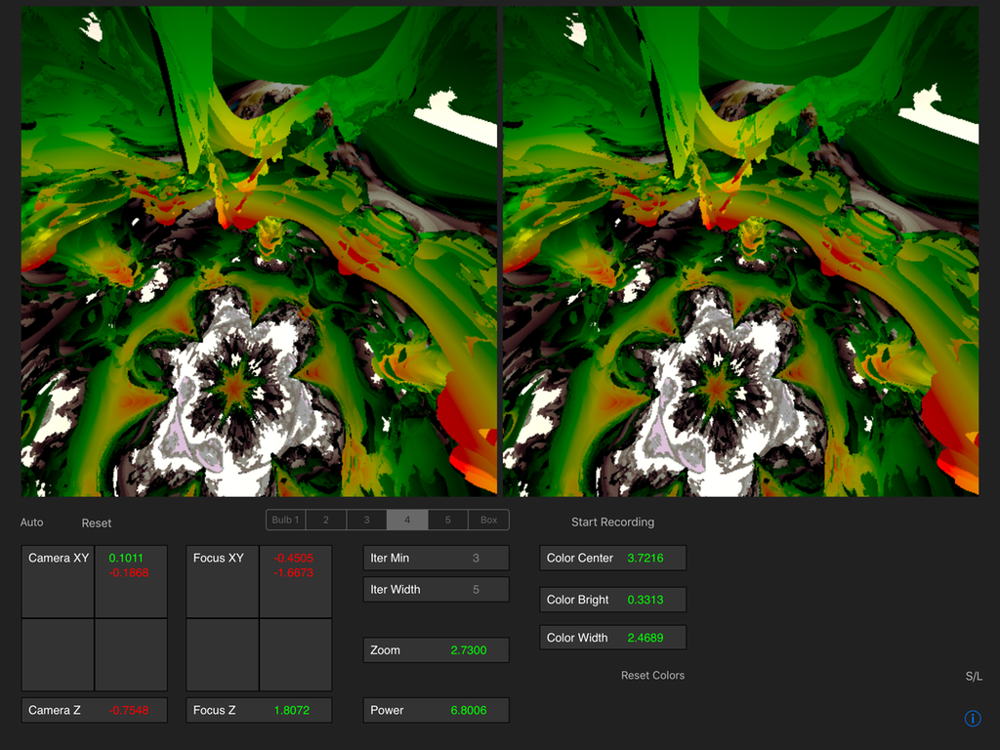
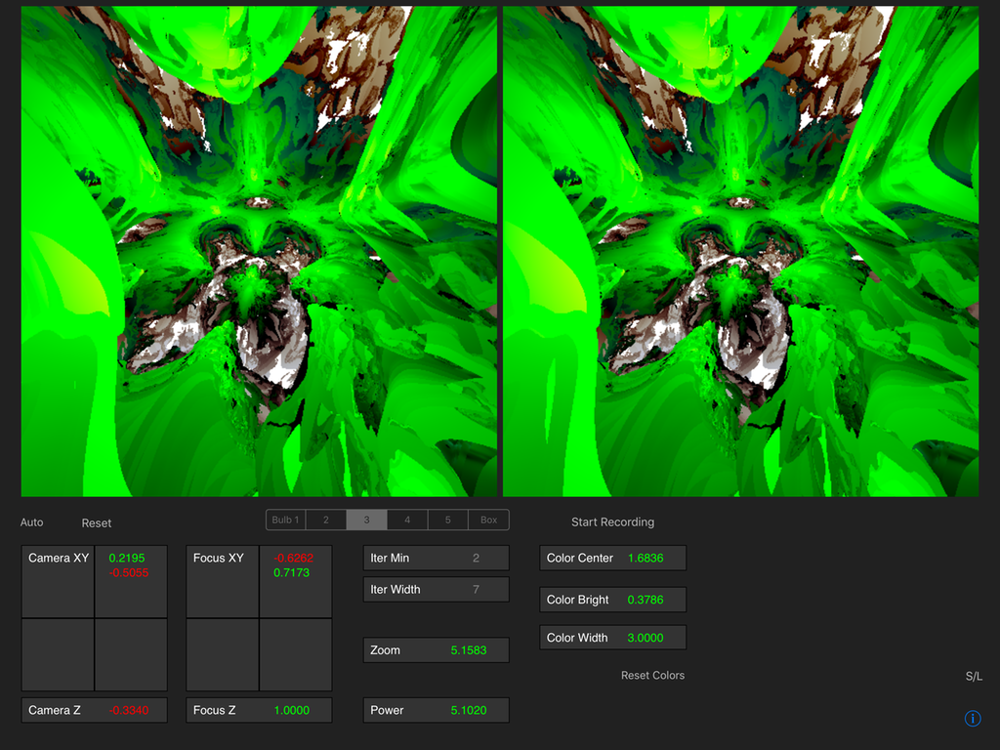

# RayMarch3D
Ray Marching MandelBulb using Swift and Metal

Work in progress.
Experimenting with ray marching algorithm so that you can view the interior of the Mandelbulb.
Using Swift and Metal for IOS.
Demonstrates compute shaders, and using shader to draw to a texture for Swift to display as a UIImage.

Image is rendered twice, for 'cross-eyed' 3D viewing.
(With the iPad held two feet away, slightly cross your eyes so that there is a third image in the middle.
Relax your gaze, and concentrate only on that middle image, which is in 3D).

//Apology:  Currently the storyboard layout is correct only for the 12.9" iPad. 
//Haven't figured out how to make separate layouts for different devices yet.
//Hope to fix this soon.

Update: new version does layout programmatically, for iPad mini, 10.5" and 12.9" pros,  portrait and landscape.
please let me know it it doesn't work for you.

Also note: if the program crashes, complaining about the texture not configured, do the following:
Edit the Scheme: Run - Options:  set Metal API Validation to "Disabled"
(click on "RayMarch3D" on the Xcode titlebar to launch "Edit Scheme..")

